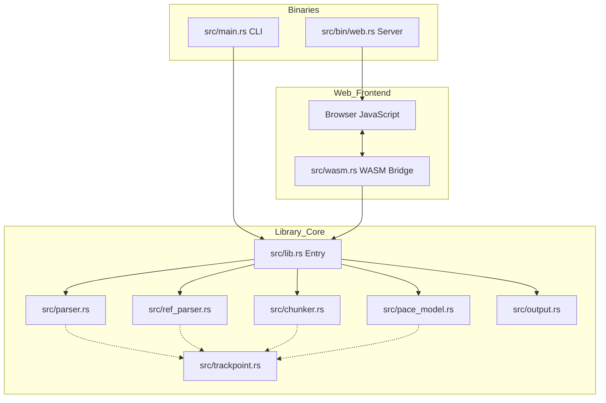
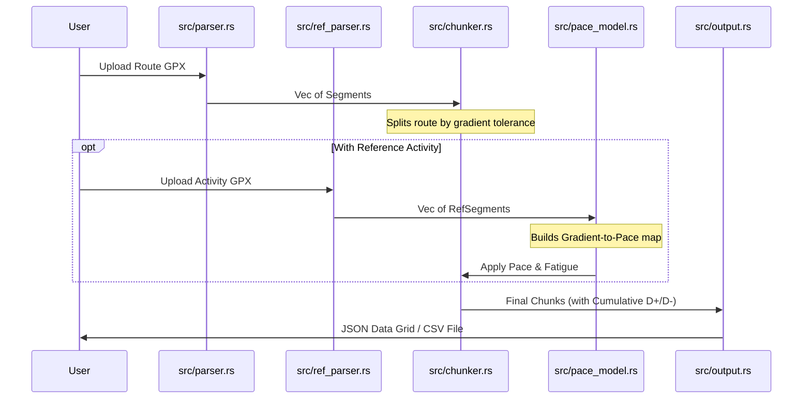

# Project Architecture: GPX Splitter

This document explains how the various Rust modules in this project interact to transform raw GPS data into actionable race plans.

## System Overview

The project is structured as a library (`src/lib.rs`) with three distinct ways to interact with the core logic:

1.  **CLI (`src/main.rs`)**: A traditional command-line tool.
2.  **Web Server (`src/bin/web.rs`)**: A minimal Axum server used to deliver static assets.
3.  **WASM (`src/wasm.rs`)**: The primary web engine that runs the logic directly in the browser.

---

## Data Flow

The core of the application is a pipeline that processes "Segments" into "Chunks".

---

## Module Responsibilities

| Module | Purpose | Key Structures |
| :--- | :--- | :--- |
| `trackpoint.rs` | Shared data primitives. | `TrackPoint`, `Segment` |
| `parser.rs` | Reads the race route GPX. | `parse_gpx_reader` |
| `ref_parser.rs` | Reads a past activity GPX (recorded on a watch). | `RefSegment`, `parse_ref_gpx_reader` |
| `pace_model.rs` | Computes pace based on gradient and fatigue. | `PaceModel`, `DegradationProfile` |
| `chunker.rs` | **The Core Algorithm**: Merges segments into gradient blocks. | `Chunk`, `chunkify`, `apply_pace_model` |
| `output.rs` | Formats data for storage or display. | `write_csv_to_writer` |
| `wasm.rs` | High-level API exposed to the browser. | `GpxAnalyzer`, `RoutePoint` |

---

## The Fatigue Model

Fatigue is calculated in `src/pace_model.rs` using a **Power Law** curve. This allows for non-linear slowdowns (e.g., "hitting the wall").

$$Multiplier = 1.0 + TotalFactor \times Progress^{FatigueExponent}$$

*   **Progress**: 0.0 (start) to 1.0 (finish).
*   **TotalFactor**: The total slowdown percentage (e.g., 0.25 for "Heavy").
*   **Exponent**: 1.0 (Linear), 2.0 (Accelerated), 3.0+ (Late Crash).

---

## Manual Pace Model (Minetti Cost Curve)

Manual mode used to pick one of 9 fixed paces (flat + 4 uphill/4 downhill zones) by nearest gradient bucket, with hard cutoffs at ±1/3/6/10%. That produced visible pace jumps right at zone boundaries. `src/pace_model.rs` now fixes this two ways:

1.  **`minetti_cost(gradient)`** implements the 5th-order polynomial from Minetti et al. (2002), "Energy cost of walking and running at extreme uphill and downhill slopes" — the metabolic-cost curve behind most Grade Adjusted Pace calculators. `minetti_pace_multiplier(gradient_pct)` turns that into a pace multiplier relative to flat.
2.  **`ManualPaces::from_flat_pace(flat_spm, hill_sensitivity)`** seeds all 8 zone paces from a single flat pace, using that multiplier. `hill_sensitivity` scales uphill and downhill *asymmetrically*: uphill deviation is scaled by `hill_sensitivity` directly (>1.0 slower climbs), downhill deviation by `2.0 - hill_sensitivity` (>1.0 shrinks the downhill speed bonus instead of amplifying it — naively scaling the signed deviation would otherwise make descents *faster* as sensitivity rises, which is backwards). Exposed to the web UI as `suggest_manual_paces()`.
3.  A fixed floor (`VERY_STEEP_DOWNHILL_BRAKING_FACTOR`, 1.15×) guarantees `very_steep_downhill` is never faster than `steep_downhill`. Minetti's curve alone doesn't turn back upward until around -20% grade, so without this floor, very steep descents would end up *faster* than moderately steep ones at every sensitivity setting — real trail terrain doesn't allow that; braking for control, confidence, and to limit eccentric muscle damage forces a real slowdown well before -20%.
4.  **`ManualPaces::pace_at(gradient_pct)`** treats each zone's pace as an anchor point at its representative gradient (±2/4.5/8/13%, mirroring the old zone midpoints) and linearly interpolates between anchors — the same pattern `PaceModel::pace_at` already used for automatic mode. Zone inputs stay individually editable; interpolation just removes the boundary jump.

---

## Chunker Logic (The "Split" Algorithm)

The `chunkify` function in `src/chunker.rs` iterates through every GPS point and decides whether to continue the current chunk or start a new one based on:
1.  **Gradient Tolerance**: Does the next segment change the overall slope significantly?
2.  **Minimum Distance**: Is the current chunk long enough to be meaningful?

When a split occurs, the chunker calculates the **Cumulative Distance**, **Cumulative D+**, and **Cumulative D-** to provide a running total for the athlete's race plan.

---

## Elevation Smoothing

Before segments are built, `parser.rs` runs a centred moving average (`ELEVATION_SMOOTHING_WINDOW`, 5 points) over raw trackpoint elevation. Point-to-point GPX elevation — GPS or barometric — is noisy enough that a single 1-2 m blip between two nearby points can register as a triple-digit gradient. Smoothing it out before gradients are computed means the chunker splits on genuine terrain changes rather than sensor noise, and D+/D- totals aren't inflated by jitter that would otherwise cancel out over any real distance. Lat/lon are untouched — only elevation (and everything downstream of it) is affected.

---

## Route Preview (Map + Elevation Chart)

The web UI renders a MapLibre GL map and a canvas-based elevation chart, both driven by `GpxAnalyzer::get_route_points()` — a full-resolution `{lat, lon, elevation, distance_km}[]` built directly from the parsed input segments, independent of chunking/pace settings. `static/app.js` fetches this once per uploaded file and re-derives colors on every recompute:

- **Map**: the route is a GeoJSON `LineString` on an OSM raster basemap, colored with a `line-gradient` paint expression keyed on `["line-progress"]`.
- **Elevation chart**: a `<canvas>` profile of distance vs. elevation, stroked segment-by-segment in the same colors.

Both use the same color scale, built from the current `Chunk[]`: pace-based (green = fast, red = slow) whenever chunks carry `estimated_pace`, falling back to gradient-based (blue = downhill, red = uphill) before a reference activity or manual paces are supplied.
